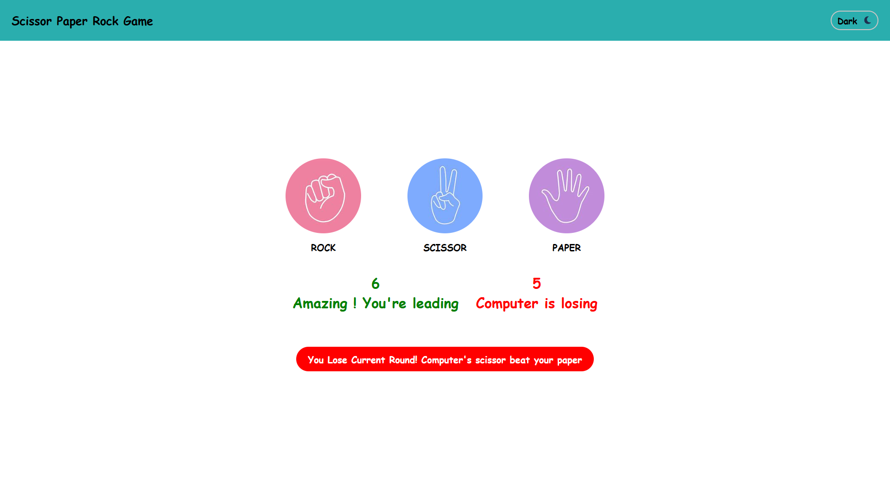

# ✊✌️🖐️ Rock Paper Scissor Game

Welcome to the classic **Rock Paper Scissor Game** built with **HTML, CSS, and JavaScript**!  
This project is interactive, responsive, and comes with a sleek **dark/light mode toggle**.



---

## 🔥 Features

- 🎮 **Classic Game Mechanics** — Rock beats Scissor, Scissor beats Paper, Paper beats Rock
- 🌗 **Dark / Light Theme Toggle**
- 📱 **Responsive Design** — Works on both desktop and mobile
- 💯 **Score Tracker** — Real-time user vs computer scoreboard
- 🧠 **Random Computer Choices**
- 💬 **Result Messages** — Fun and motivating feedback

---

## 🛠️ Tech Stack

- **HTML5**
- **CSS3**
- **Vanilla JavaScript**

---
##Live Preview
[See live](https://rps.thapasusil.com.np)
---

## 🚀 How to Run

1. **Clone this repo**
   ```bash
   git clone https://github.com/SusilThapa1/Game.git
   ```
